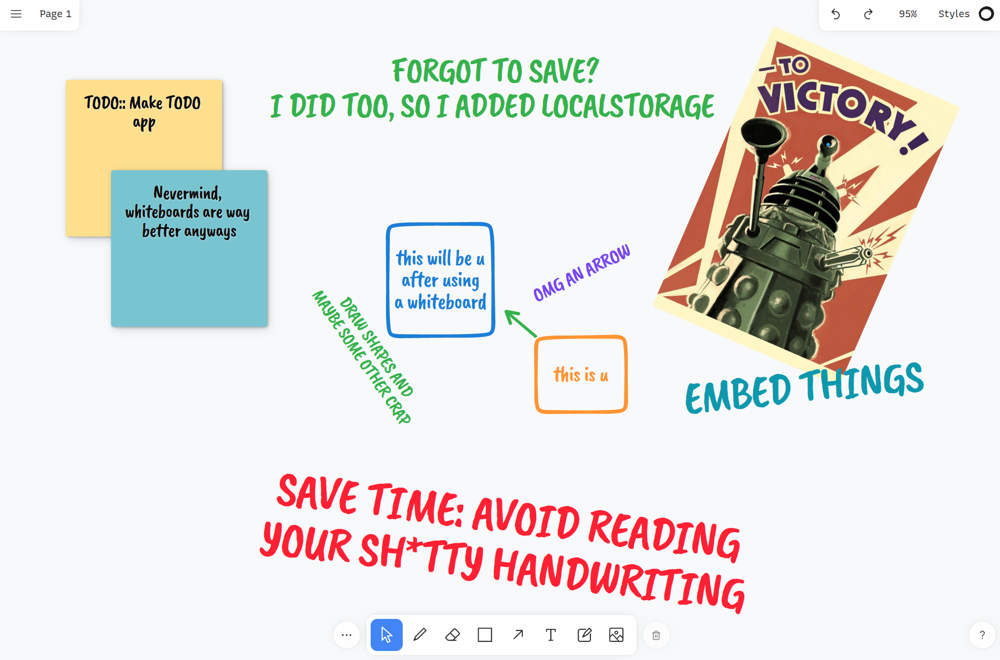

# tldraw-whiteboard

_**A personal whiteboard for self-hosting. Turns a secondary screen into a self-mastery tool.**_



This is a wrapper application for [tldraw](https://github.com/tldraw/tldraw). I take no credit for the whiteboard experience as it's completely borrowed.

## Differences

- Unsaved documents are persisted in localStorage to prevent data-loss on browser crashes.
- No analytics or telemetry (outside of any within [tldraw](https://github.com/tldraw/tldraw))
- Built for Docker/podman. Easily deployed to NAS/Self-hosting infrastructures.

## Create the container

> Docker and podman commands are interchangeable - podman is better though

```bash
# Build the core (requires npm/nodejs)
npm ci
npm run build:prod

# Create new container (published port)
podman run \
    --name="whiteboard" \
    -v ./www:/public:Z \
    -p 8080:80 \
    --detach \
    joseluisq/static-web-server:latest;
```

> See [the sws image docs](https://static-web-server.net/features/docker/#dockerfile) for more details and configurations

> *For best results, it's best if you put containers behind a load balancer if you can for performance and security reason. If using a load balancer, using a shared network is better than using a published port.*


## Upcoming changes

- Allow large embeds in cache (right now persistence will fail if uploads are near or above 5MB in size due to localStorage constraints)
- Re-plug code to typescript once prototyping/testing phase is done
- Potential server-side persisting for containerized environments